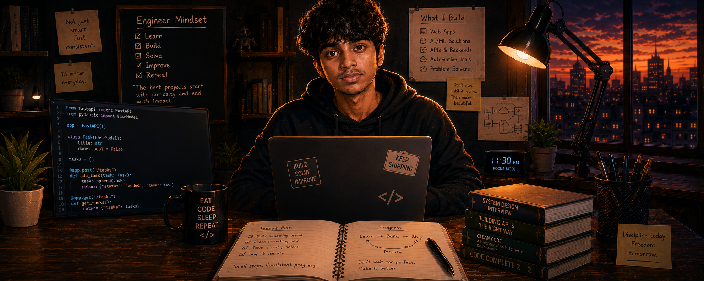
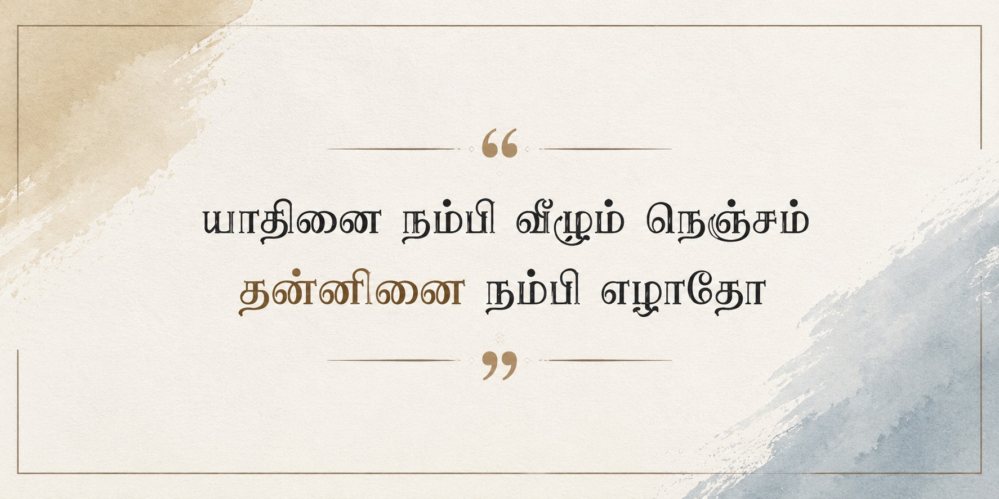
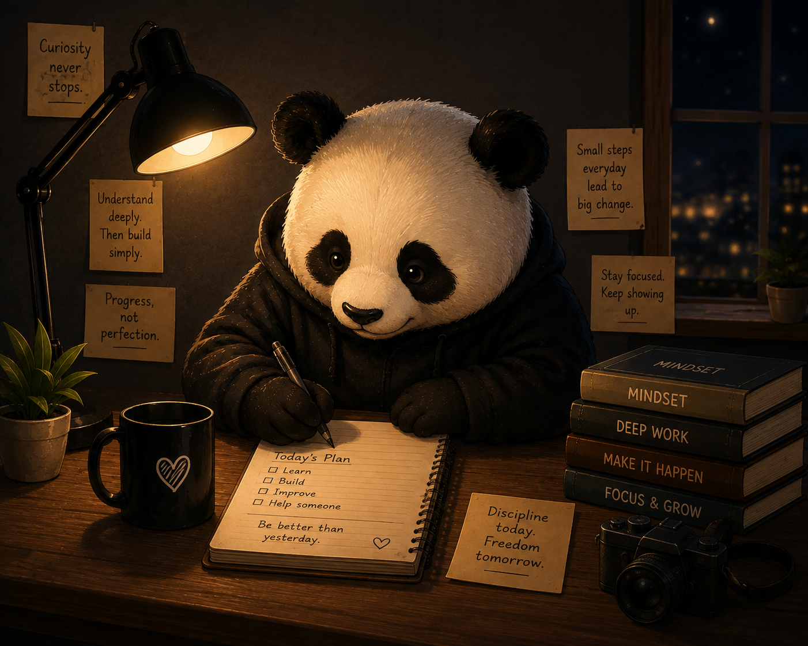

<div align="center">



<br>

### *Build · Break · Understand*

</div>

<br>

---

## About Me

<table>
<tr>
<td valign="top" width="50%">

```python
class Hashwin:
    role       = "AI & Data Science Student"
    but_mostly = "I build with AI"
    #            Python · ML/DL · data · full-stack
    also        = "I ship projects when an idea won't let me rest"
    currently   = "going deeper on ML, DL, AI applications & backend engineering"

    def how_i_work(self):
        return ("curious by nature — I'd "
                "rather understand a thing "
                "than just use it")
```

</td>
<td valign="top" align="center" width="50%">


</td>
</tr>
</table>

<br>

---

## Stack & Tools

<p>
  
  <br>
  
</p>
<p>
  
  
  
  
  
  
  
  
  
  
  
  
</p>

<br>

---

<div align="center">



</div>

<br>

---

## Projects

<!-- Add featured projects here later -->

<br>

---

## What Drives Me

<table>
<tr>
<td valign="top" width="60%">

I enjoy building things that solve actual problems, especially where AI and software can work together. I prefer understanding the fundamentals before relying on abstractions, but I also believe the best way to learn is to build and experiment. Most of my projects start with a simple question: *"Can I actually make this work?"*

</td>
<td valign="top" align="center" width="40%">



</td>
</tr>
</table>

<br>

---

## Let's Connect

<div align="center">

[](https://github.com/Hashwin28)
[](https://www.linkedin.com/in/hashwin-m-45027b388)
[](mailto:hashwinmuthukumar@gmail.com)

<!-- Portfolio badge — add here later -->

</div>

<br>
